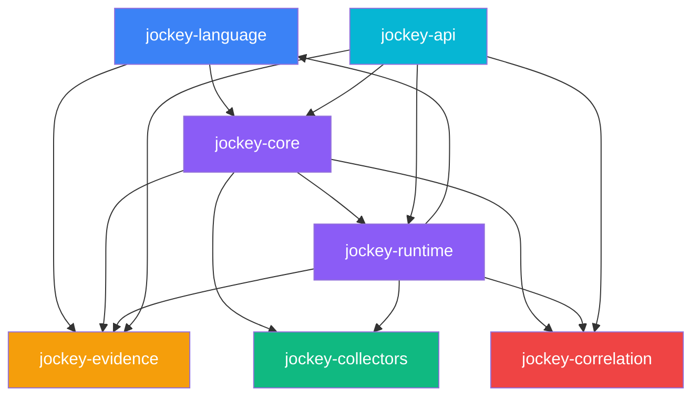

# System Architecture

**Status**: SPECIFIED

---

## Crate Structure

| Crate | Responsibility | Public API |
|-------|----------------|------------|
| `jockey-language` | Parser, AST, type checker, diagnostics | `parse()`, `type_check()`, `lower_to_ir()` |
| `jockey-core` | IR, Execution Contract, Policy, Capabilities, Storage | `IrModule`, `ExecutionContract`, `PolicyEngine` |
| `jockey-runtime` | Execution engine, dispatcher, sandbox | `Runtime::execute(contract)` |
| `jockey-evidence` | Evidence, Receipt, Provenance, Finding, Export | `Evidence`, `EvidenceReceipt`, `ProvenanceRecord` |
| `jockey-collectors` | Collector trait, Win/Lin implementations | `Collector::execute()`, `CollectorRegistry` |
| `jockey-correlation` | Rules engine, graph builder, query API | `Correlator::correlate()`, `InvestigationGraph` |
| `jockey-api` | Axum HTTP server, WebSocket, OpenAPI | `serve()`, `routes()` |

---

## Component Interfaces

```rust
// jockey-language
pub fn parse(source: &str) -> Result<AstModule, ParseError>;
pub fn type_check(ast: &AstModule) -> Result<TypedAst, TypeError>;
pub fn lower_to_ir(typed: &TypedAst) -> Result<IrModule, LowerError>;

// jockey-core
pub fn build_contract(ir: &IrModule, target: TargetSpec, policy: Policy) -> ExecutionContract;
pub fn validate_contract(contract: &ExecutionContract, registry: &CollectorRegistry) -> Result<(), PolicyError>;

// jockey-runtime
pub async fn execute(contract: ExecutionContract) -> Result<ExecutionResult, RuntimeError>;

// jockey-evidence
pub fn verify_receipt(receipt: &EvidenceReceipt, evidence: &Evidence) -> Result<(), VerifyError>;
pub fn verify_provenance_chain(chain: &[ProvenanceRecord]) -> Result<(), VerifyError>;

// jockey-collectors
#[async_trait]
pub trait Collector: Send + Sync {
    fn name(&self) -> &'static str;
    fn version(&self) -> &'static str;
    fn supported_actions(&self) -> Vec<&'static str>;
    fn supported_os(&self) -> Vec<&'static str>;
    async fn execute(&self, action: &str, params: Value, ctx: &ExecutionContext) -> Result<CollectorOutput, CollectorError>;
}

// jockey-correlation
pub fn correlate(evidence: &[Evidence], rules: &[CorrelationRule]) -> Vec<CorrelationEdge>;
pub struct InvestigationGraph { /* petgraph::Graph<EvidenceNode, CorrelationEdge> */ }

// jockey-api
pub fn serve(addr: SocketAddr, state: AppState) -> Result<(), ServerError>;
```

---

## Module Dependencies



---

## IR (Intermediate Representation)

### Structure

```json
{
  "version": 1,
  "id": "ULID",
  "metadata": {
    "name": "",
    "description": "",
    "author": "",
    "created_at": "RFC3339",
    "tags": []
  },
  "steps": [
    {
      "id": "ULID",
      "collector": "windows_evt",
      "action": "query",
      "params": { "channel": "Security", "query": "*[System/EventID=4625]" },
      "binds": ["logon_events"],
      "depends_on": [],
      "condition": null
    }
  ],
  "outputs": [
    { "name": "findings", "from_step": "step_id", "field": "findings" }
  ]
}
```

### Key Properties

- **ULIDs** for all IDs (monotonic, sortable, no coordination)
- **Explicit dependencies** enable parallel execution
- **Collector/action/params fully resolved** (no DSL references)
- **Output bindings** declare data flow

### IR Step

```rust
struct IRStep {
    id: String,                    // ULID
    collector: String,             // e.g., "windows_evt"
    action: String,                // e.g., "query"
    params: Value,                 // Resolved parameters
    binds: Vec<String>,            // Output variable names
    depends_on: Vec<String>,       // Step IDs this depends on
    condition: Option<String>,     // Optional guard expression
}
```

---

## Execution Contract

### Structure

```json
{
  "ir_id": "ULID",
  "run_id": "ULID",
  "target": { "type": "live|dead|image|remote", "identifier": "", "os": "windows|linux|darwin", "arch": "" },
  "steps": [
    {
      "step_id": "ULID",
      "collector": "windows_evt",
      "action": "query",
      "params": { ... },
      "output_vars": ["logon_events"],
      "timeout_ms": 30000,
      "retry": { "max_attempts": 2, "backoff_ms": 1000 }
    }
  ],
  "policy": {
    "parallelism": 2,
    "continue_on_error": false,
    "evidence_root": "C:\\jocky\\evidence\\<run_id>",
    "hash_algorithm": "blake3"
  },
  "context": {}
}
```

### Policy Enforcement Points

1. **Collector Allowlist** — Only registered collectors for target OS
2. **Parameter Schema Validation** — JSON Schema per collector/action
3. **Timeout Bounds** — Min 1s, max 300s per step
3. **Evidence Root Isolation** — Chroot-style path restriction
4. **Hash Algorithm Pinning** — blake3 or SHA-256 only
5. **Collector Version Pinning** — Exact version in contract

---

## Runtime Execution Model

### Dispatcher

```rust
struct Dispatcher {
    registry: CollectorRegistry,
    policy: Policy,
    evidence_root: PathBuf,
}

impl Dispatcher {
    async fn execute(&self, contract: ExecutionContract) -> Result<ExecutionResult, RuntimeError> {
        // 1. Topological sort steps by depends_on
        // 2. Group by parallelism limit
        // 3. For each batch: spawn async tasks
        // 4. Collect results, handle retries
        // 5. Return aggregated result
    }
}
```

### Execution Context

```rust
struct ExecutionContext {
    run_id: String,
    evidence_root: PathBuf,
    target: TargetSpec,
    temp_dir: PathBuf,
    credentials: Option<Value>,
}
```

### Collector Output

```rust
struct CollectorOutput {
    evidence: Vec<Evidence>,
    artifacts: Vec<ArtifactRef>,
    metrics: CollectorMetrics,
}
```

---

## Storage Layer

### SQLite Schema

See `JOCKY_SPEC_SHEET.md` Section 17 for complete schema.

Key tables:
- `investigations` — Root investigation records
- `evidence` — Evidence objects
- `receipts` — Evidence receipts (1:1 with evidence)
- `provenance` — Provenance chain records
- `correlations` — Correlation edges
- `findings` — Detection findings
- `hypotheses` — Analyst hypotheses
- `timelines` — Built timelines

### Storage Access

```rust
struct Storage {
    conn: rusqlite::Connection,
}

impl Storage {
    fn create_investigation(&self, inv: &Investigation) -> Result<()>;
    fn add_evidence(&self, ev: &Evidence) -> Result<()>;
    fn add_receipt(&self, receipt: &EvidenceReceipt) -> Result<()>;
    fn add_provenance(&self, prov: &ProvenanceRecord) -> Result<()>;
    fn add_correlation(&self, corr: &CorrelationEdge) -> Result<()>;
    fn add_finding(&self, finding: &Finding) -> Result<()>;
    fn get_investigation(&self, run_id: &str) -> Result<Investigation>;
    fn get_evidence_for_run(&self, run_id: &str) -> Result<Vec<Evidence>>;
    // ... query methods
}
```

---

## Related Documents

- `overview.md` — Architecture overview
- `data-flow.md` — Evidence pipeline and data flow
- `execution-contract.md` — Execution Contract specification
- `collector-architecture.md` — Collector trait and implementations
- `correlation-architecture.md` — Correlation rules and graph
- `deployment-model.md` — Deployment topology and models
- `evidence-pipeline.md` — Evidence pipeline details